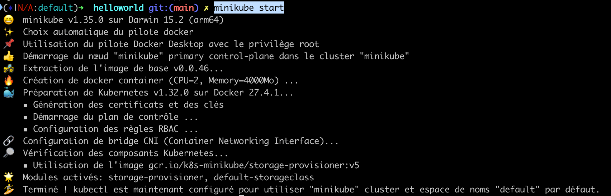
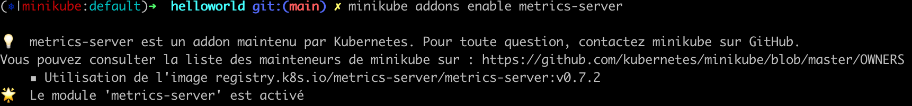
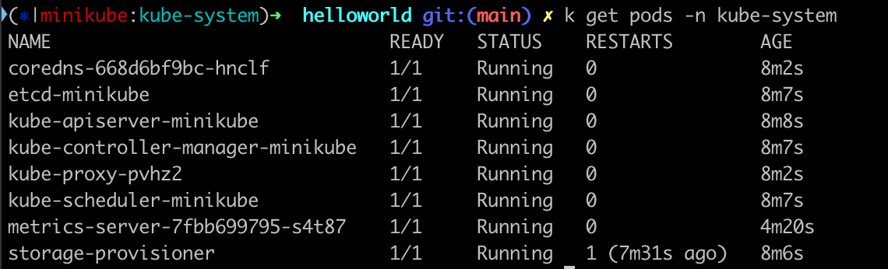
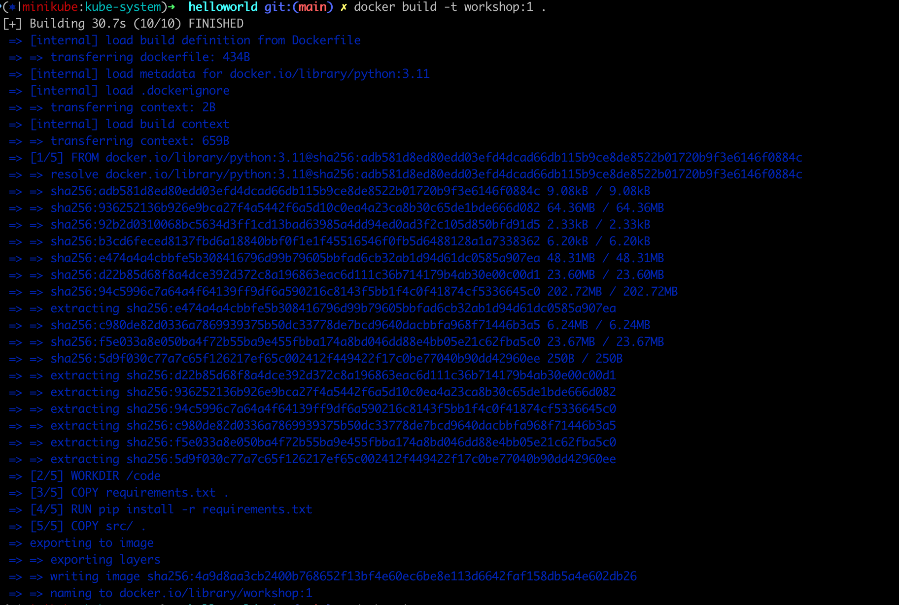
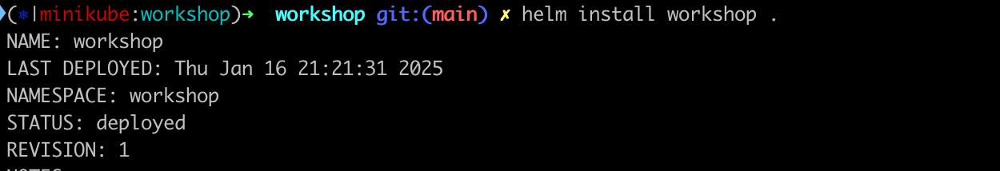
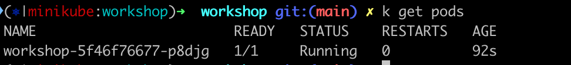
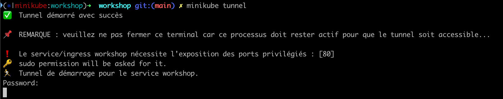
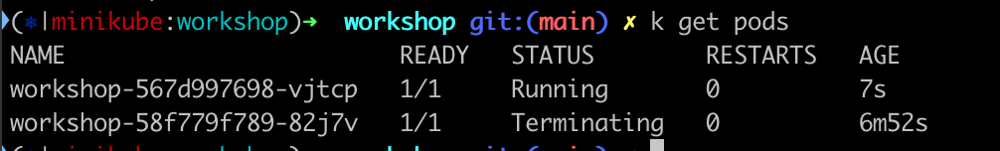
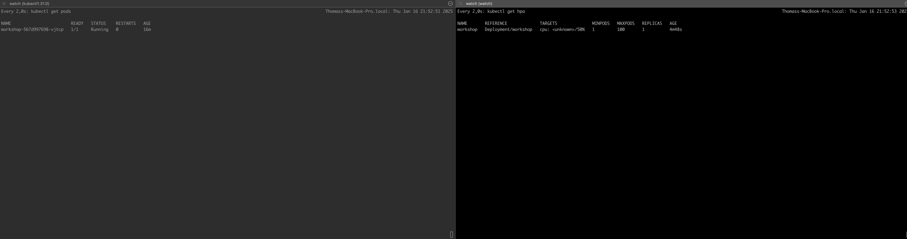
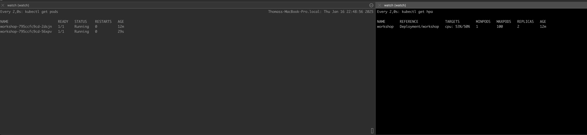

# kubernetes-workshop

## Requirements

Install minikube : please follow steps [here](https://minikube.sigs.k8s.io/docs/start/?arch=%2Fmacos%2Farm64%2Fstable%2Fbinary+download)

Install vegeta : installation guide [here](https://github.com/tsenart/vegeta?tab=readme-ov-file#install)

kubectx / kubens : installation guide [here](https://github.com/ahmetb/kubectx?tab=readme-ov-file#installation)

---

## 1. Start minikube and configuration

To start minikube : 

```
minikube start
```

You should see the result as this 



Then to be able to scale our applications in the cluster we should add metrics-server addon in the cluster. 

Definition : Metrics Server is a scalable, efficient source of container resource metrics for Kubernetes built-in autoscaling pipelines.

This expose container metrics into the kubernetes api.

```
minikube addons enable metrics-server
```

Result :



We have now a kubernetes cluster ready, we can see pods in it ie : `kubectl get pods -n kube-system`



## 2. Build Docker image

Let's se docker env to minikube to be able to expose image into our local kubernetes cluster : 

```
val $(minikube docker-env)
```

Now we can build the docker image for this hello-world application

```
docker build -t workshop:1 .
```



## 3. Create basic helm chart

Let's use helm to create an helm chart.

Definition of helm : 
>Helm helps you manage Kubernetes applications — Helm Charts help you define, install, and upgrade even the most complex Kubernetes application.
>Charts are easy to create, version, share, and publish — so start using Helm and stop the copy-and-paste.

```
helm create workshop
```

This will create a default helm chart with a deployment, hpa, service and values that can be configured

In templates/ you can see kubernetes objects that as templating variables. values.yaml contains values that will be used to render templates. deployment.yaml is for the kubernetes deployment.

Let's reference our newly created docker image :

```
image:
  repository: workshop < name of the image
  pullPolicy: IfNotPresent
  # Overrides the image tag whose default is the chart appVersion.
  tag: "1" < tag of the image
```

## 4. Deploy the application

Let's deploy it !

First let's create the namespace.

```
kubectl create namespace workshop
```

Switch to this namespace :

```
kns workshop
```

Deploy the helm chart :

```
helm install workshop .
```



Let's check if pods are running now :

```
kubectl get pods
```



You should see a pod with the status Running.

## 5. Let's expose it

First we need to change the service type to LoadBalancer in values.yaml

```
service:
  type: LoadBalancer
  port: 80
```

Then start a tunnel to minikube to expose the kubernetes service to your local machine : 

```
minikube tunnel
```



And now visit http://localhost you should see hello world !

## 6. Release a new version

In `src/server.py` modify the return in main route to : `return "Hello World! Version 2"`

build docker image with a tag named 2:

```
docker build -t workshop:2 .
```

Modify the tag in values.yaml 

```
image:
  repository: workshop
  pullPolicy: IfNotPresent
  # Overrides the image tag whose default is the chart appVersion.
  tag: "2" < HERE
```

Deploy the new version with helm :

```
helm upgrade workshop .
```

You should see pods doing a rollout one pod is created and another is terminated when the other one is ready :




Now when you visit http://localhost you should see :

Hello World! Version 2

## 6. Scale automatically your application

!!! Warrning this part can be hard tell me if you can't do it sorry.

We need to edit some configuration to make metrics server more reactive by fetching more frequently : 

```
kubectl edit deployment metrics-server -n kube-system
```

Modify under spec/template/containers/args metric-resolution from 60s to 15s

```
    - --metric-resolution=15s
```

Enable autoscaling in the helm chart modify in values.yaml : 

```
autoscaling:
  enabled: true < HERE false to true
  minReplicas: 1 < min number of replicas 1
  maxReplicas: 100 < max number of replicas 100
  targetCPUUtilizationPercentage: 50 < HERE from 80 to 50 to target average cpu usage 50%
  # targetMemoryUtilizationPercentage: 80
```

Set bounded resource for the container : 

```
resources:
  limits:
    cpu: 100m
    memory: 128Mi
  requests:
    cpu: 100m
    memory: 128Mi
```

Deploy : 
```
helm upgrade workshop .
```

You should see a new horizontal pods autoscaler object here 
min / max , replicas = current number of replicas set by the hpa


In a splitted terminal follow number of pods and hpa metrics : 

in one do : 
```
watch kubectl get pods
```

in another one do 

```
watch kubectl get hpa
```



Launch a first load test  : 

```
echo "GET http://localhost:80/" | vegeta attack -duration=120s -rate 4 -keepalive false | tee results.bin | vegeta report
```

New pod should come



if you describe hpa object `kubectl describe hpa workshop` you should see : 

```
  Normal   SuccessfulRescale             2m15s              horizontal-pod-autoscaler  New size: 2; reason: cpu resource utilization (percentage of request) above target
```


If we increase rate a new pods should come : 

```
echo "GET http://localhost:80/" | vegeta attack -duration=120s -rate 7 -keepalive false | tee results.bin | vegeta report
```

```
  Normal   SuccessfulRescale             15s                horizontal-pod-autoscaler  New size: 3; reason: cpu resource utilization (percentage of request) above target
```

Then if we stop scale down should happen after 60s.

event in `kubectl describe hpa workshop` :
```
  Normal   SuccessfulRescale             8m46s              horizontal-pod-autoscaler  New size: 1; reason: All metrics below target
```

Congrats you deployed you first application and make it scale !

## 7. Cleanup

```
minikube stop
minikube delete
```

Thanks for attending to this workshop !